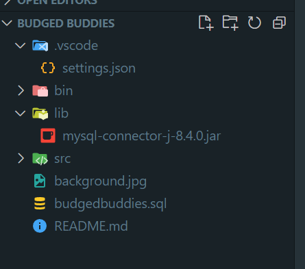

<b>This is a new branch for the back-end requirements of the app</b>
 
<h1>Team members: </h1>
<ul>
<li>Olga Saridou</li>
<li>Eleni Tsotsou</li>
<li>Athina Papachatzi</li>
</ul>

# Οδηγίες

Το zip είναι ο κώδικας. Το jar είναι η βιβλιοθήκη. Το sql είναι η βάση. 
Κατεβάζετε το xampp αν δεν το έχετε ήδη.
Κάνετε εισαγωγή την βιβλιοθήκη. Και στον κώδικα στο αρχείο settings αλλάζετε την τοποθεσία της βιβλιοθήκης με την αντίστοιχη δική σας.
Στο xampp κάνετε start τα 2 πρώτα.(Apache & SQL)(Θα πρέπει να τρέχουν πάντα ώστε να δουλευει η βάση)
Οταν τρέχουν κι τα 2 μπαίνετε στο site: http://localhost/phpmyadmin/
Κάνετε new, για να δημιουργήσετε νέα βάση, πηγαίνετε στην καρτέλα import. Επιλέγεται το αρχείο της βάσης. Πατάτε import. 
Και τρέχετε το project

<h3>Η δομή του project για να λειτουργήσει θα πρέπει να είναι αυτήν:</h3>
 

